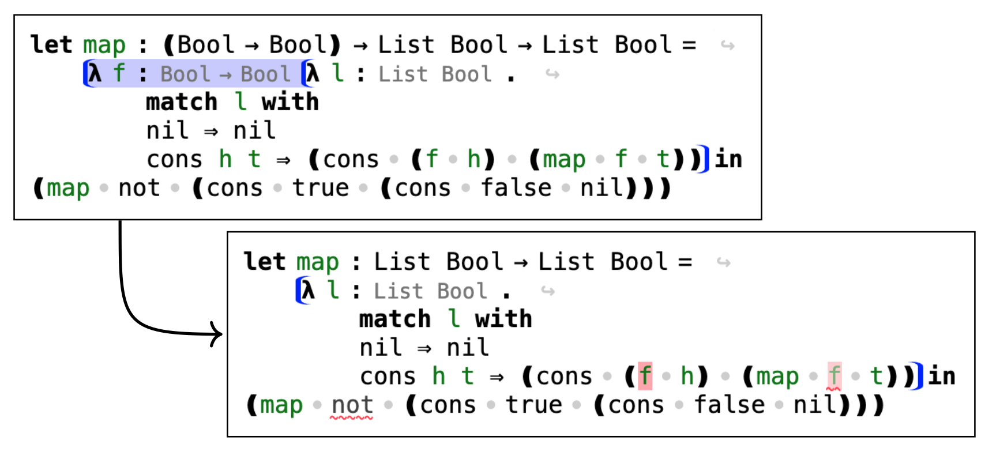

# Pantograph


This is the source code for Pantograph, a structure editor.
It was written by [Jacob Prinz](https://jeprinz.github.io/) and [Henry Blanchette](https://rybl.net).

Associated POPL 2025 paper: [Pantograph: A Fluid and Typed Structure Editor](https://arxiv.org/pdf/2411.16571).

[Try it online](https://pantographeditor.github.io/Pantograph/).

Table of Contents
- [Pantograph](#pantograph)
  - [What is Pantograph](#what-is-pantograph)
    - [Well-grammared programming (zipper editing)](#well-grammared-programming-zipper-editing)
    - [Well-typed programming](#well-typed-programming)
  - [Development](#development)
  - [Design](#design)
  - [Organization](#organization)
  - [Citation](#citation)


## What is Pantograph

### Well-grammared programming (zipper editing)

Unlike a traditional code editor in which text is parsed and then typechecked, Pantograph operates directly on a typed syntax tree.
Users may fill in typed holes to input programs, here by inserting a list `l2`:


Many existing structure editors allow the user to fill holes, and manipulate entire terms.
But how can one edit existing programs? In particular, suppose that the programmer realizes that l2 never contains negative numbers, and decides to
optimize the expression by moving the execution of the append operation to after the filter.

To make this edit by only manipulating entire terms would be difficult. One could imagine various user interfaces, but generally the manipulation would look like this:


Pantograph makes edits to existing program easier by introducing a notion of a *tree selection*. If a text selection goes between two text cursors, and a tree cursor goes on a subtree,
then a tree selection goes between two subtrees. It is the area inside one subtree and outside another, also known as a one-hole context.
Using this notion, the programmer can make the above edit easily:


Even better, it turns out that nearly all common program edits on functional code have this form:


We call this editing scheme with tree cursors and selection *zipper editing*.

### Well-typed programming

Zipper editing, like the traditional structure editing it extends, preserves the syntactic well-formedness of programs. However, it does not necessarily preserve well-typedness.

Any system that aims to operate on intrinsically typed terms needs to account for how such an edit changes types in the program. To that end, we will introduce a grammar of type diffs, encoding precisely how a type is transformed into a new type after an edit. 

When the user inserts a `λ` expression around the body of map, Pantograph automatically makes the edits necessary to keep the program well typed. The system adds an application to a hole at the two call sites, and alters the type signature.


Pantograph fully takes into account the intrinsically-typed structure of the program, so it can handle more deeply-nested edits, for example, adding a higher-order argument.


Of course, it is not always desirable for an editor to fix typing issues automatically. Sometimes, Pantograph leaves errors in the program for the user to fix later. For example, suppose that the user deletes the f parameter from a finished map function.

When the user makes the deletion, it leaves a couple of errors in the program. There is an unbound call to `f`, and an out of place argument at the two call sites to map. While the system could simply replace the former with a hole and remove the latter two from the program, this would likely erase valuable work that the programmer wanted to keep.

To allow such errors to exist in an otherwise well typed program, Pantograph has three final constructions:
- **free variables** e.g. in the first code example below, the references to `f` after `λ f` is deleted
- **commented applications** e.g. in the first code example below, the argument `not` which is given to `map` even though `map` only takes 1 argument after `λ f` is deleted
- **type error boundaries** e.g. in the second code example below, `(f h)` and `not` no longer have the correct type and Pantograph did not have a canonical way to fix it




Note that type error boundaries are just another part of the context, so, for instance, you can delete it as a one-hole context such as in the following code example. Performing this edit will force Pantograph to update _the rest_ of the program to respect the inner type of the type error boundary.


## Development

To develop Pantograph, you need the following command line tools installed:
- [pnpm](https://pnpm.io/installation)

To build the project:
```sh
pnpm install
pnpm build
```

To serve the web application:
```sh
pnpm serve
```

## Design

This implementation is designed to be language-generic.
The `Language.Pantograph.Generic.*` modules implement the mechanics of a Pantograph editor given an editor specification.
**To define a new editor**, you must define a term of the type `Language.Pantograph.Generic.Rendering.Base.EditorSpec l r`, where `l` is the type of _sort_ labels, and `r` is the type of _derivation_ labels.
Additionally, `l` and `r` must instantiate `Language.Pantograph.Generic.Grammar.IsRuleLabel l r`.

One complete specific editor is given in the codebase, and can be found in `Language.Pantograph.Specific.Currying`.
The editor implemented here is the same as the one demonstrated in the Pantograph paper, used in the Pantograph paper's user study, and available in the runnable artifact (and hosted online at `jeprinz.github.com/pantograph`).
This is a good place to start in order to understand how to define a new editor.
Other related editor fragments can be found among the other `Language.Pantograph.Specific.*` modules.

The general paradigm behind how languages are implemented is described in Section 5 of the paper.
A language consists of a set of _sorts_ (which are encoded trees of _sort labels_; see `Language.Pantograph.Generic.Grammar.Sort`), which are essentially the possible judgements, while a program is a derivation (which are encoded as trees of _derivation labels_, which are pairs of a _derivation rule label_ and a _rule variable substitution_; see `Language.Pantograph.Generic.Grammar.DerivTerm`) of a sort.

## Organization

The implementation in `src/` is organized as follows:
- `Data.*` modules contain miscelleneous generic data types
- `Halogen.*` modules contain extra Halogen-related functionalities
- `Language.Pantograph.Generic.*` modules contain the language-generic implementation of Pantograph
- `Language.Pantograph.Specific.*` modules contain editor instances for specific languages
  - in particular, in the current version of the repository, only `Language.Pantograph.Specific.Currying` is fully implemented
- `Language.Pantograph.Lib.*` modules contain useful functionalities for defining specific editor instances (for example, language-generically deriving the propagation rules as mentioned in the paper)
- `Tutorial.*` contains all the functionalities specific to the Pantograph tutorial (e.g. defining the tutorial UI and lessons)

## Citation

To cite the Pantograph paper associated with this repository:

```bibtex
@article{pantograph,
  author = {Prinz J, Blanchette H, Lampropoulos L},
  title = {Pantograph: Pantograph: A Fluid and Typed Structure Editor},
  journal = {POPL},
  year = {2025},
  doi = {10.1145/3704864}
}
```
